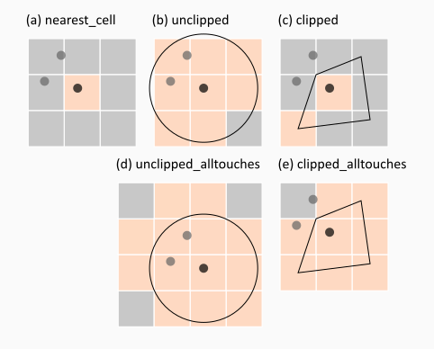

## Zonal Statistics

This folder contains several command line tools for performing zonal statistics around points. Most of the tools are built upon the following packages such that installing them are necessary:
- [numpy](https://numpy.org)
- [pandas](https://pandas.pydata.org)
- [geopandas](https://geopandas.org)
- [rasterio](https://rasterio.readthedocs.io)
- [rasterstats](https://pythonhosted.org/rasterstats/)
- [scipy](https://scipy.org)
- [shapely](https://shapely.readthedocs.io/en/stable/manual.html)

To install the required package, open the command prompt or [Anaconda](https://www.anaconda.com) and use `pip install [package name]`. Alternatively, `conda install [package name]` can also be used in the Anaconda.

### Preparing Buffers
`get_buffer.py` is a script to create circular buffers surrounding points of interest. This can be supplied with CSV containing geocoordinates (lat,lon) or vector file with valid geometries. Type `python get_buffer.py --help` to know how to use this script.

If non overalapping buffers are intended, clipping process is performed by pruning the original circular buffers with Voronoi edges generated from the points of interest.


Example:
```
# Create buffer from points listed in CSV file
python get_buffer.py --input sample/points_1.csv --rad 5 --clip --output sample/points

# Create buffer from points listed in geopackage file
python get_buffer.py --input sample/points_1.gpkg --rad 10 --clip --output sample/points

# Update create file (points_10km_clipped.gpkg) by adding 
# extra buffers from a new geopackage file (points_2.gpkg)
python get_buffer.py --input sample/points_10km_clipped.gpkg --add sample/points_2.gpkg --clip --output sample/points
```

### Performing Zonal Statistics
`zonal_statistics.py` is a script to extract zonal statistics from raster input based on the list of features provided. Copy the script to the working directory to use it. Type `python zonal_statistics.py --help` to know how to use this script.

### Extracting Population Count from WorldPop Dataset
WorldPop produces global population count at 100 m and 1 km resolutions. Extended description about the data can be found [in the WorldPop page](https://hub.worldpop.org/project/categories?id=3) and the associated publications mentioned in that page.

Provided this gridded/raster data and the vector data containing the regions of interest (or buffers), the total population at each region can be extracted using `get_population.py`. There are several modes of extraction:
1. *nearest_cell*: Population count at the cell nearest to the point of interest.
2. *unclipped*: If circular buffer around point of interest is provided, 



Example:
```python
python get_population.py
```