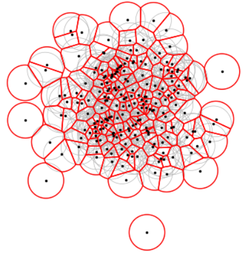

## Zonal Statistics

This folder contains several scripts for performing zonal statistics around points, especially for extracting population count from the gridded population data. Most of the tools are built upon the following packages such that installing them is necessary:
- [numpy](https://numpy.org)
- [pandas](https://pandas.pydata.org)
- [fiona](https://fiona.readthedocs.io)
- [geopandas](https://geopandas.org)
- [rasterio](https://rasterio.readthedocs.io)
- [rasterstats](https://pythonhosted.org/rasterstats/)
- [scipy](https://scipy.org)
- [shapely](https://shapely.readthedocs.io/en/stable/manual.html)

To install the required package, open the command prompt or [Anaconda](https://www.anaconda.com) and use `pip install [package name]`. Alternatively, `conda install [package name]` can also be used in the Anaconda.

### Preparing Buffers
`get_buffer.py` is a script to create circular buffers surrounding points of interest. This can be supplied with CSV containing geocoordinates (lat,lon) or vector files with valid geometries. Type `python get_buffer.py --help` to know how to use this script.

If non-overlapping buffers are intended, the clipping process is performed by pruning the original circular buffers with Voronoi cells generated from the points of interest.



Example:
```
# Create buffer from points listed in CSV file
python get_buffer.py --input sample/points_1.csv --rad 5 --clip --output sample/points

# Create buffer from points listed in geopackage file
python get_buffer.py --input sample/points_1.gpkg --rad 10 --clip --output sample/points

# Revise items from the original geopackage file with IDs listed in the secondary input file
python get_buffer.py --input sample/points_10km_clipped.gpkg --edit sample/points_1_edit.csv --rad 10 --clip --output sample/reduced

The secondary input file is CSV with *remark* column defining the process applied to the item. It can either be *add*, *remove*/*delete*, or *edit*. See /sample/points_1_edit.csv as an example.
```

### Extracting Population Count from WorldPop Dataset
WorldPop produces global population count at 100-m and 1-km resolutions. An extended description of the data can be found on [the WorldPop page](https://hub.worldpop.org/project/categories?id=3) and the associated publications mentioned on that page.

Provided this gridded/raster data and the vector data containing the regions of interest (or buffers), the total population at each region can be extracted using `get_population.py`. This script comes together with `config.py` which defines several parameters required for the process. There are:
- `year_start` and `year_end` [integer]: WorldPop provides a global gridded population dataset from 2015 to 2023. Users can define the dataset epoch from which the extraction is performed, from `year_start` to `year_end`.
- `radii` [list of integer]: radii of circular buffers in kilometres.
- `location` [path-like]: path to the file containing the locations of interest or the buffers around the locations. The accepted file should be CSV, XLS, SHP, GPKG, or GEOJSON. The file should contain either the `geometry` or `lat` and `lon` columns. If `processing_mode` is *edit*, this variable defines the path to the secondary file containing locations to edit the _default_ geometry files (`geom/buffer*.gpkg`) and population tables (`pop_*.csv`).
- `raster_file` [path-like]: path to the population raster file (GeoTIFF format).
- `processing_mode` [string]: either *new* or *edit*.
- `clipped_only` [boolean]: if false, the script extracts the population count from both clipped and unclipped circular buffers.
- `versioning` [boolean]: if true, the script will save CSV files with a suffix defining the date of creation.

The output files are kept in `geom/` and `out/` folders. Geopackage (GPKG) containing the buffers can be found in `geom/` while the population table (CSV) is kept in `out/`.

### Zonal Statistics Wrapper
`zonal_statistics.py` is a script to extract zonal statistics from raster input based on the list of features provided. Copy the script to the working directory to use it. Type `python zonal_statistics.py --help` to know how to use this script.

___
Contact: Rhorom Priyatikanto | <rp1y21@soton.ac.uk>
